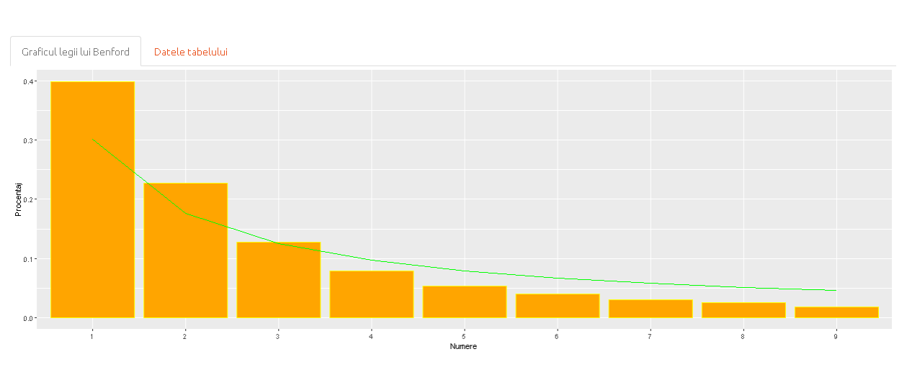
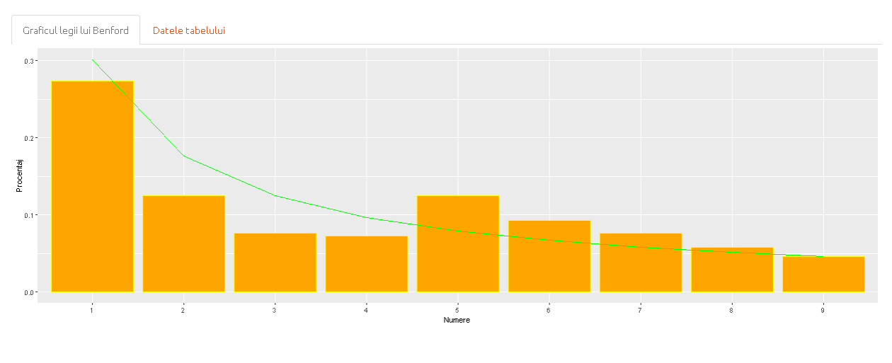
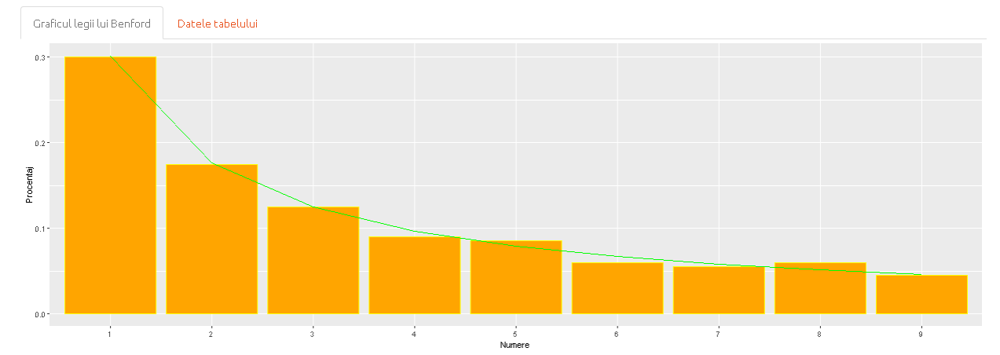

## Descriere

**Legea lui Benford**, numită și Legea Primei Cifre, cuprinde observații cu privire la frecvența primei cifre a unor seturi de date din realitate. Legea atestă faptul că în majoritatea colecțiilor alcătuite într-un mod natural, cifra aflată pe prima poziție are tendința să fie o cifră mai mică. În seturile care respectă această lege, s-a observat faptul că vom avea cifra 1 pe prima poziție în aproximativ 30% din cazuri, iar cifra 9 în mai puțin de 5% din cazuri. Dacă cifrele ar fi distribuite într-o manieră uniformă, fiecare dintre aceste cifre ar apărea pe prima poziție în 11,1% din cazuri. Legea lui Benford este folosită și pentru prezicerea distribuției celei de-a doua cifră, cât și pentru prezicerea unor combinații de cifre. Respectarea predicției acestei legi a fost observată atât în cazul trecerii prin toate valorile ale numărului de locuitori ai unei țări, cât și în cazul șirului lui Fibonacci și șirul puterilor lui 2.

În jurul anului 1938, fizicianul **Frank Benford** a observat faptul ca tabelele logaritmice erau mai uzate în primele pagini față de ultimele. Acesta a testat ipoteza care susținea că cifrele mai mici au o frecvență de apariție mai mare decât cifrele mai mari pe 30 de seturi de date, obținând astfel legea. Folosindu-ne de Legea lui Benford putem face o predicție cu privire la distribuția cifrelor de la 1 la 9 la nivelul unui set de date. Probabilitatea apariției este generata astfel de această formulă:

$P(D = d)=lg(1+\frac{1}{d})\ , unde \ d\in\{1..9\}$

Tot cu legea lui Benford se poate calcula și probabilitatea apariției primelor 2 cifre sub un anumit format:

$P(D = d)=lg(1+\frac{1}{d})\ , unde \ d\in\{10..99\}$


## Despre Aplicatia noastra

Am ilustrat corectitudinea **Legii lui Benford** pe urmatoarele trei seturi de date:

  1. [Totalul de nume comune](#unu) 
  2. [Sirul lui Fibonacci](#doi) 
  3. [Numarul de locuitori din orasele lumii](#trei) 
  
###  [Date despre totalul de nume comune din SUA](#unu) 
Link: https://data.world/len/us-first-names-database 

**Primul set de date** contine o colectie de nume des intalnite si totalul lor in societatea americana.



### [Șirul lui Fibonacci](#doi)
Link: https://www.kaggle.com/brandonconrady/fibonacci-sequence-first-10001-numbers

**Al doilea set de date** cuprinde informații despre populația din orasele luimii. Am ales acest set de date observând faptul că datele din acest tabel respectă condițiile Legii lui Benford.




### [Numarul de locuitori din orasele lumii](#trei) 
Link: https://simplemaps.com/data/world-cities

**Al treilea set de date** cuprinde informații despre populația din marile orase ale lumii.




## Implementarea Aplicatiei


Codul nostru este impartit in 3 componente:

  1. [Interfața Utilizatorului (UI)](#ui) 
  2. [Server](#srv) 
  3. [ShinyApp](#shiny) 

### [Interfața Utilizatorului (UI)](#ui)

```R
    ui <- fluidPage(theme = shinytheme("united"),
  navbarPage("Legea lui Benford",
             tabPanel("Introducere",
             withMathJax(includeMarkdown("raport.Rmd"))),
             
             tabPanel("Raport Nume",
                      h4("Date incluse: 2020"),
                      h4("Date preluate din USA"),
                      
                      sidebarLayout(
                        sidebarPanel(
                          sliderInput(inputId = "numeComune",
                                      label = "Numarul de Nume care au fost prelucrate",
                                      min = 1,
                                      max = 39417,
                                      value = 20000
                          )
                        ),
                        mainPanel(
                          tabsetPanel(
                            tabPanel("Graficul legii lui Benford", plotOutput("dateName")),
                            tabPanel("Datele tabelului", DT::dataTableOutput("NumeTabel"))
                          )
                        )
                      )
             ),
             tabPanel("Raport Populatie a oraselor lumii",
                      h4("Date incluse: 2022"),
                      h4("Date preluate din lume"),
                      
                      sidebarLayout(
                        sidebarPanel(
                          sliderInput(inputId = "roCensus",
                                      label = "Numarul de orase care au fost prelucrate",
                                      min = 1,
                                      max = 42906,
                                      value = 5000
                          )
                        ),
                        mainPanel(
                          tabsetPanel(
                            tabPanel("Graficul legii lui Benford", plotOutput("dateCensus")),
                            tabPanel("Datele tabelului", DT::dataTableOutput("censusTabel"))
                          )
                        )
                      )
             ),
             tabPanel("Raport sirul lui Fibonacci",
                      h4("Sirul lui Fibonacci este un exemplul clasic al legii lui Benford."),
                      
                      sidebarLayout(
                        sidebarPanel(h4("Fibonacci"),
                                     sliderInput(inputId = "nrFibo",
                                                 label = "Cate numere din sir au fost generate",
                                                 min = 1,
                                                 max = 4000,
                                                 value = 200
                                     )
                        ),
                        mainPanel(
                          tabsetPanel(
                            tabPanel("Graficul legii lui Benford", plotOutput("dateFibo")),
                            tabPanel("Datele tabelului", DT::dataTableOutput("fiboTabel"))
                          )
                        )
                      )
             )
  ),
)

```

### [Server](#srv)

```R
   # Partea de server
server <- function(session, input, output) {
  calculBenford <- function(r, nrInregistrari) {
    
    percent <- c(0 ,0, 0, 0, 0, 0, 0, 0, 0)
    freq <- c(0 ,0, 0, 0, 0, 0, 0, 0, 0)
    benfordV <- c(0 ,0, 0, 0, 0, 0, 0, 0, 0)
    
    #extragem prima cifra dintr-un numar, chiar si dupa virgula
    firstDigit<-function(x) as.numeric(substr(gsub('[0.]', '', x), 1, 1)) 
    
    #Pe dataframe-ul transmis prelucram prima cifra din fiecare inregistrare si adunam la frecventa generala
    for(i in 1:nrInregistrari) {
      num<-firstDigit(r[i])
      freq[num] <- freq[num] + 1
    }
    
    
    for (i in 1:9) {
      percent[i] <- freq[i] / nrInregistrari
    }
    
    for( i in 1:9) {
      benfordV[i] <- log10(1 + 1 / i)
    }
    
    dataFrame <- data.frame (
      Numere = c("1", "2", "3", "4", "5", "6", "7", "8", "9"),
      benford = benfordV,
      Procentaj = percent
    )
    
    ggplot(data = dataFrame, aes(x = Numere, group = 1)) + geom_bar(aes(y = Procentaj), stat = "identity", color = "yellow", fill = "orange") + geom_line(aes(y = benford), stat = "identity", color = "green")
    
  }
  
  output$dateName <- renderPlot({
    censusFile <- (read.csv("Nume_comune_2000.csv", header = TRUE))
    
    valCensus <- censusFile$Count
    
    censUS <- data.frame(
      Nume = censusFile$Name,
      Population = censusFile$Count
    )
    
    output$NumeTabel = DT::renderDataTable({censUS})
    
    calculBenford(valCensus, input$numeComune)
  })
  
  output$dateFibo <- renderPlot({
    fiboFile <- (read.csv("fibo.csv", header = TRUE))
    
    valFibo <- fiboFile$Value
    
    
    fibo <- data.frame(
      Index = fiboFile$Iteration,
      Value = fiboFile$Value
    )
    
    output$fiboTabel = DT::renderDataTable({fibo})
    calculBenford(valFibo, input$nrFibo)
  })
  
  output$dateCensus <- renderPlot({
    censusFile <- (read.csv("worldcities.csv", header = TRUE))
    
    valCensus <- censusFile$Population
    
    censUS <- data.frame(
      Population = censusFile$Population
    )
    
    output$censusTabel = DT::renderDataTable({censUS})
    
    calculBenford(valCensus, input$roCensus)
  })
  
}
```

### [ShinyApp](#shiny) 

Aplicatia poate fi rulata cu urmatoarea instructiune:

```R
    shinyApp(ui = ui, server = server)
```

